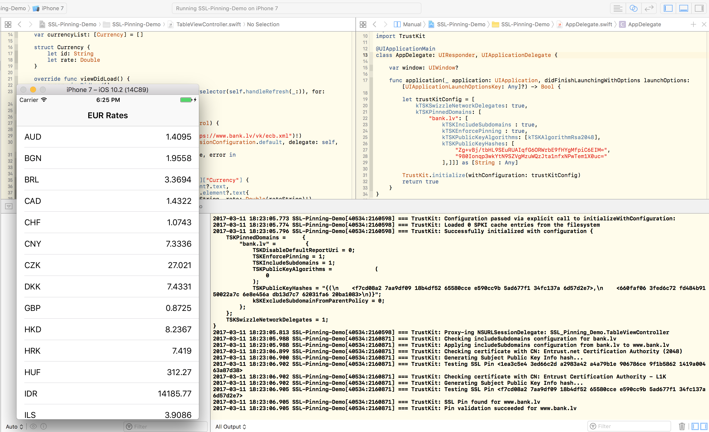

# SSL-Pinning-Demo
Simple EUR rates with SSL pinning demo app

Application fetching EUR rates (in XML) and pin SSL certificates fingerprints.

<p align="center">
  
</p>


Instructions for extract certificate fingerprint:

```
openssl x509 -inform der -in certificate.cer -out certificate.pem
openssl x509 -noout -in certificate.pem -pubkey | openssl asn1parse -noout -inform pem -out public.key
openssl dgst -sha256 -binary public.key | openssl enc -base64
```

## References

* [HTTP Public Key Pinning Extension HPKP for Apache, NGINX and Lighttpd](https://raymii.org/s/articles/HTTP_Public_Key_Pinning_Extension_HPKP.html)
* [Bank.lv Rates Description](https://www.bank.lv/component/content/article/8656-eiropas-centrls-bankas-publictie-eiro-atsauces-kursi-xml-formt)
* [Bank.lv Rates XML](https://www.bank.lv/vk/ecb.xml)